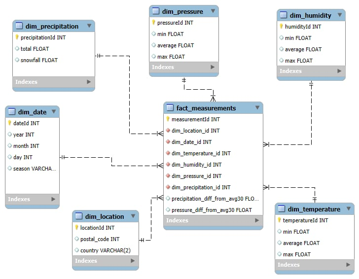
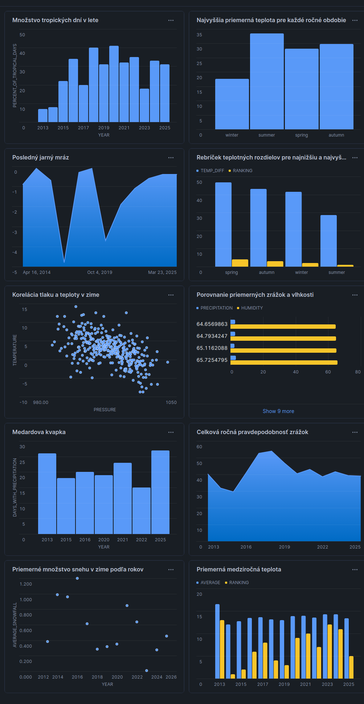

# ELT proces datasetu Weather New York

Tento repozitár obsahuje projekt pre predmet Databázové technológie. Jeho cieľom bolo transformovať dáta zo Snowflake Marketplace do hviezdicovej schémy cez ELT proces. Ako podkladové dáta bol vybraný dataset "Snowpark for Python - Hands-on-Lab - Weather Data by Pelmorex Weather Source". Tento dataset obsahuje dáta o počasí v New Yorku od roku 2013. Projekt sa zameriava na preskúmanie týchto dát s cieľom poskytnúť analýzu dát o počasí v New Yorku, ktoré sa dajú využiť pri rozhodovaní ktoré s ním súvisí.

## Úvod a popis zdrojových dát

Dáta sú v datasete poskytované skrze dve tabuľky:

* `history_day` - obsahuje údaje o minulých nameraných hodnotách počasia
* `forecast_day` - obsahuje predpoveď počasia pre new york

Vzhľadom na účel projektu sme pracovali iba s tabuľkou `history_day`, ktorá má nasledujúci formát:


## Dimenzionálny model

Dáta boli spracované podľa hviezdicovej schémy (star schémy) ktorá obsahuje jednu tabuľku faktov (facts_measurement) ktorá je spojená s nasledujúcimi šiestimi dimenziami:

* `dim_location` - obsahuje údaje o lokácií (krajina, PSČ)
* `dim_date` - obsahuje údaje o dátume (rok, mesiac, deň, ročné obdobie)
* `dim_temperature` - obsahuje údaje o teplote (minimálna, priemerná, maximálna)
* `dim_humidity` - obsahuje údaje o vlhkosti (minimálna, priemerná, maximálna)
* `dim_pressure`- obsahuje údaje o tlaku (minimálna, priemerná, maximálna)
* `dim_precipitation` - obsahuje údaje o zrážkach (celkové, snehové)

Vzájoné prepojenie tabuliek je vizuálne znázornené na tomto entitno-relačnom diagrame:



## ELT proces v Snowflake

ELT proces je zložený z troch častí: Extract (extrahovanie) / Load (nahrávanie) / Transform (transformovanie). Dáta boli spracované týmto spôsobom, aby sa s nimi dalo lepšie pracovať.

### Extract (extrahovanie dát)

Nakoľko za podkladový dataset sme použili dataset zo snowflake marketplace, tento krok už bol za nás vykonaný poskytovateľmi údajov.

### Load (nahrávanie dát)

Dáta z datasetu boli v tomto kroku nahrané do staging tabuľky. Keďže sme nepotrebovali úplne všetky údaje z pôvodného datasetu, do staging tabuľky boli vybrané iba tie relevantné. Staging tabuľka bola vytvorená a naplnená údajmi týmto SQL:

```
CREATE TABLE history_day_staging AS SELECT
    POSTAL_CODE,
    COUNTRY,
    DATE_VALID_STD,
    MIN_TEMPERATURE_AIR_2M_C,
    AVG_TEMPERATURE_AIR_2M_C,
    MAX_TEMPERATURE_AIR_2M_C,
    MIN_HUMIDITY_RELATIVE_2M_PCT,
    AVG_HUMIDITY_RELATIVE_2M_PCT,
    MAX_HUMIDITY_RELATIVE_2M_PCT,
    MIN_PRESSURE_2M_MB,
    AVG_PRESSURE_2M_MB,
    MAX_PRESSURE_2M_MB,
    TOT_PRECIPITATION_MM,
    TOT_SNOWFALL_CM
FROM SNOWPARK_FOR_PYTHON__HANDSONLAB__WEATHER_DATA_BY_PELMOREX_WEATHER_SOURCE.ONPOINT_ID.HISTORY_DAY;
```

### Transform (transformácia dát)

V tomto kroku boli dáta transformované do hviezdicovej schémy, boli vyčistené a taktiež obohatené o niektoré údaje. Dimenzie boli navrhnuté vzhľadom na faktovú tabuľku, ktorej riadok vždy popisuje dáta jednodenného merania. Nakoľko počasie v minulosti je nemenné, všetky dimenzie sú typu `SCD 0`.

#### dim_location

```
CREATE TABLE dim_location AS SELECT
    DISTINCT CONCAT(COUNTRY, POSTAL_CODE) AS locationId,
    POSTAL_CODE,
    COUNTRY
FROM history_day_staging;
```

Táto dimenzia popisuje lokáciu v ktorej boli údaje o počasí namerané.

#### dim_date

```
CREATE TABLE dim_date AS SELECT
    DISTINCT DATE_VALID_STD AS dateId,
    YEAR(DATE_VALID_STD) AS year,
    MONTH(DATE_VALID_STD) AS month,
    DAY(DATE_VALID_STD) AS day,
    CASE 
        WHEN MONTH(DATE_VALID_STD) IN (12, 1, 2) THEN 'winter'
        WHEN MONTH(DATE_VALID_STD) IN (3, 4, 5) THEN 'spring'
        WHEN MONTH(DATE_VALID_STD) IN (6, 7, 8) THEN 'summer'
        WHEN MONTH(DATE_VALID_STD) IN (9, 10, 11) THEN 'autumn'
    END AS season
FROM history_day_staging;
```

Táto dimenzia popisuje dátum merania. Obohacuje ho o ročné obdobie v ktorom sa nachádza.

#### dim_temperature

```
CREATE TABLE dim_temperature AS SELECT
    DISTINCT CONCAT(MIN_TEMPERATURE_AIR_2M_C, AVG_TEMPERATURE_AIR_2M_C, MAX_TEMPERATURE_AIR_2M_C) AS temperatureId,
    MIN_TEMPERATURE_AIR_2M_C AS min,
    AVG_TEMPERATURE_AIR_2M_C AS avg,
    MAX_TEMPERATURE_AIR_2M_C AS max
FROM history_day_staging;
```

Táto dimenzia popisuje údaje o teplote v daný deň.

#### dim_humidity

```
CREATE TABLE dim_humidity AS SELECT
    DISTINCT CONCAT(MIN_HUMIDITY_RELATIVE_2M_PCT, AVG_HUMIDITY_RELATIVE_2M_PCT, MAX_HUMIDITY_RELATIVE_2M_PCT) AS humidityId,
    MIN_HUMIDITY_RELATIVE_2M_PCT AS min,
    AVG_HUMIDITY_RELATIVE_2M_PCT AS avg,
    MAX_HUMIDITY_RELATIVE_2M_PCT AS max,
FROM history_day_staging;
```

Táto dimenzia popisuje údaje o vlhkosti v daný deň.

#### dim_pressure

```
CREATE TABLE dim_pressure AS SELECT
    DISTINCT CONCAT(MIN_PRESSURE_2M_MB, AVG_PRESSURE_2M_MB, MAX_PRESSURE_2M_MB) AS pressureId,
    MIN_PRESSURE_2M_MB AS min,
    AVG_PRESSURE_2M_MB AS avg,
    MAX_PRESSURE_2M_MB AS max,
FROM history_day_staging;
```

Táto dimenzia popisuje údaje o tlaku v daný deň.

#### dim_precipitation

```
CREATE TABLE dim_precipitation AS SELECT
    DISTINCT CONCAT(TOT_PRECIPITATION_MM, TOT_SNOWFALL_CM) AS precipitationId,
    TOT_PRECIPITATION_MM AS total,
    TOT_SNOWFALL_CM AS snowfall
FROM history_day_staging;
```

Táto dimenzia popisuje údaje o zrážkach v daý deň.

#### facts_measurement

```
CREATE TABLE facts_measurement AS SELECT
    ROW_NUMBER() OVER (ORDER BY DATE_VALID_STD) AS measurementId,
    DATE_VALID_STD AS dateId,
    CONCAT(COUNTRY, POSTAL_CODE) AS locationId,
    CONCAT(MIN_TEMPERATURE_AIR_2M_C, AVG_TEMPERATURE_AIR_2M_C, MAX_TEMPERATURE_AIR_2M_C) AS temperatureId,
    CONCAT(MIN_HUMIDITY_RELATIVE_2M_PCT, AVG_HUMIDITY_RELATIVE_2M_PCT, MAX_HUMIDITY_RELATIVE_2M_PCT) AS humidityId,
    CONCAT(MIN_PRESSURE_2M_MB, AVG_PRESSURE_2M_MB, MAX_PRESSURE_2M_MB) AS pressureId,
    CONCAT(TOT_PRECIPITATION_MM, TOT_SNOWFALL_CM) AS precipitationId,

    TOT_PRECIPITATION_MM - AVG(TOT_PRECIPITATION_MM) OVER (
        PARTITION BY locationId
        ORDER BY DATE_VALID_STD ASC
        RANGE BETWEEN INTERVAL '30 DAYS' PRECEDING AND CURRENT ROW
    ) AS precipitationDiffFromAvg30,
    AVG_PRESSURE_2M_MB - AVG(AVG_PRESSURE_2M_MB) OVER (
        PARTITION BY locationId
        ORDER BY DATE_VALID_STD ASC
        RANGE BETWEEN INTERVAL '30 DAYS' PRECEDING AND CURRENT ROW
    ) AS pressureDiffFromAvg30
FROM history_day_staging;
```

Táto tabuľka faktov prepája všetky vyššie uvedné dimenzie na konkrétne jednodňové merania. Sú v nej taktiež predrátané dve agregačné hodnoty `precipitationDiffFromAvg30` ktorá uvádza nakoľko sa množstvo zrážok líšilo od priemeru zrážok posledných tridsiatich dní a `pressureDiffFromAvg30` ktorá uvádza nakoľko sa priemerný denný tlak líšil od priemerného tlaku posledných tridsiatich dní.

Pre optimalizovanie úložiska bola na záver staging tabuľka ostránená:

```
DROP TABLE IF EXISTS history_day_staging;
```

## Vizualizácia dát

Dashboard obsahuje 10 vizualizácií ktoré zobrazujú najrôznejšie metriky o počasí.



### Graf 1: Množstvo tropických dní v lete

Táto vizualizácia zobrazuje percento tropických dní z leta v jednotlivých rokoch. Za tropický deň sa považuje deň v ktorom maximálna teplota vystúpi na 30 stupňov. Z výstupov je zremé, že tropické dni v New Yorku zvyknú pokrývať cca jednu tretinu leta.

```
SELECT d.year AS year, FLOOR(100 * COUNT(*) / 92) AS percent_of_tropical_days
FROM facts_measurement m
JOIN dim_date d ON m.dateid = d.dateid
JOIN dim_temperature t ON m.temperatureid = t.temperatureid
WHERE d.season = 'summer' AND t.max >= 30
GROUP BY year;
```

### Graf 2: Najvyššia priemerná teplota pre každé ročné obdobie

Táto vizualizácia zobrazuje najvyššiu priemernú teplotu pre každé ročné obdobie. Umožňuje získať prehľad o priemernej teplote ročného obdobia, ktorú možno očakávať. Môže byť užitočná pri plánovaní pracovných a voľnočasových aktivít.

```
SELECT season, MAX(avg) AS max_per_season FROM facts_measurement f
JOIN dim_temperature t ON f.temperatureid = t.temperatureid
JOIN dim_date d ON f.dateid = d.dateid
GROUP BY season;
```

### Graf 3: Posledný jarný mráz

Táto vizualizácia zobrazuje dátum a silu posledného mrazu na jar. Táto metrika je veľmi dôležitá pre ľudí ktorí pestujú nejaké rastliny, nakoľko podľa nej môžu určiť od ktorého dátumu im už podľa všetkého nezamrznú. Z výstupov môžeme vidieť, že posledné mrazy zvyknu bývať na začiatku apríla. Nie je teda potrebné sa obávať ešte v máji "troch zmrzlíkov" ako je to na Slovensku.

```
SELECT date, tmin
FROM (
    SELECT 
        DATE_FROM_PARTS(d.year, d.month, d.day) AS date,
        d.year AS year,
        t.min AS tmin,
        ROW_NUMBER() OVER (PARTITION BY d.year ORDER BY d.month DESC, d.day DESC) as rn
    FROM facts_measurement m
    JOIN dim_date d ON m.dateid = d.dateid
    JOIN dim_temperature t ON m.temperatureid = t.temperatureid
    WHERE d.season = 'spring' AND t.min < 0
) AS subquery
WHERE rn = 1
ORDER BY year ASC;
```

### Graf 4: Rebríček teplotných rozdielov pre najnižšiu a najvyššiu teplotu v každom ročnom období

Graf znázorňuje rebríček teplotných rozdielov pre ročné obdobia s porovnaním teplotných extrémov pre každé ročné obdobie a identifikovať teplotnú variabilitu ročných období. Vizualizácia je užitočná pri analýze teplotnej stability a ukazuje premenlivosť počasia v danom období.

```
WITH season_temp_intervals AS (
    SELECT season, MIN(min) AS min_temp, MAX(max) AS max_temp
    FROM facts_measurement f
    JOIN dim_date d ON f.dateid = d.dateid
    JOIN dim_temperature t ON f.temperatureid = t.temperatureid
    GROUP BY season
)
SELECT *, (max_temp - min_temp) AS temp_diff, row_number() OVER (
    ORDER BY temp_diff
) AS ranking
FROM season_temp_intervals;
```

### Graf 5: Korelácia tlaku a teploty v zime

Táto vizualizácia skúma vzájomné pôsobenie teploty a tlaku. Na Slovensku v zime nižší tlak znamená v priemere zvýšenie dennej teploty, a vyšší tlak naopak zníženie dennej teploty. Vizualizácia dáva do pomeru tieto dva údaje v New Yorku a zisťuje, že tam je to rovnako. Táto metrika umožňuje v zime jednoduchšie predpovedať počasie podľa tendencie tlaku.

```
SELECT p.avg AS pressure, AVG(t.avg) AS temperature
FROM facts_measurement m
JOIN dim_date d ON m.dateid = d.dateid
JOIN dim_pressure p ON m.pressureid = p.pressureid
JOIN dim_temperature t ON m.temperatureid = t.temperatureid
WHERE d.season = 'winter'
GROUP BY p.avg
ORDER BY p.avg ASC;
```

### Graf 6: Porovnanie priemerných zrážok a vlhkosti

Táto vizualizácia zobrazuje priemerné zrážky a vlhkosť za rok. Jej cieľom je skúmať či existuje nejaká korelácia medzi množstvom zrážok a vlhkosťou vzduchu. Vo výsledku môžeme vidieť, že táto korelácia je minimálna. Ukazuje to, že priame zrážky sami o sebe nie sú jediným meradlom pre vlhkosť vzduchu.

```
SELECT d.year AS year, AVG(p.total) AS precipitation, AVG(h.avg) AS humidity
FROM facts_measurement m
JOIN dim_date d ON m.dateid = d.dateid
JOIN dim_humidity h ON m.humidityid = h.humidityid
JOIN dim_precipitation p ON m.precipitationid = p.precipitationid
GROUP BY year
ORDER BY humidity ASC;
```

### Graf 7: Medardova kvapka

Táto vizualizácia zobrazuje roky v ktorých na Medarda (8 jún) pršalo, a v koľkých nasledujúcich 40 dňoch sa vyskytli nejaké zrážky. Jedná sa o testovanie slovenského príslovia "Medardova kvapka štyridsať dní kvapká". Vo vizualizácií môžeme vidieť, že v rokoch kedy v New Yorku na Medarka pršalo v nasledujúcich 40 dňoch zvyklo pršať asi v polovici. Nejedná sa teda o úplne doslovné splnenie slovenského príslovia, ale dá sa predpokladať, že pršanie v čase Medarda je spojené s celkovým vlhkejším obdobím.

```
WITH years_with_precipitation_on_medard AS (
    SELECT DISTINCT d.year AS year
    FROM facts_measurement m
    JOIN dim_date d ON m.dateid = d.dateid
    JOIN dim_precipitation p ON m.precipitationid = p.precipitationid
    WHERE d.month = 6 AND d.day = 8 AND p.total > 0
)
SELECT d.year AS year, COUNT(*) AS days_with_precipitation
FROM facts_measurement m
JOIN dim_date d ON m.dateid = d.dateid
JOIN dim_precipitation p ON m.precipitationid = p.precipitationid
WHERE
    d.year IN (SELECT year FROM years_with_precipitation_on_medard)
    AND DAYOFYEAR(DATE_FROM_PARTS(d.year, d.month, d.day)) BETWEEN 159 AND 199
    AND p.total > 0
GROUP BY year;
```

### Graf 8: Celková ročná pravdepodobnosť zrážok

Tabuľka znázorňuje pravdepodobnosť dňa so zrážkami, pričom vychádza z historických dát. Pravdepodobnosť sa počíta pre každý rok. Počíta sa ako podiel počtu dní, pri ktorých boli namerané zrážky, delené celkovým počtom meraní v danom roku. Výsledok podielu je ešte prenásobený stom. Je užitočný pre porovnanie zrážkovej činnosti pre merané roky.

```
WITH measurements AS (
    SELECT
        d.year,
        COUNT(*) AS total_measurements,
        SUM(CASE WHEN p.total = 0 THEN 1 ELSE 0 END) AS zero_precip_measurements,
        SUM(CASE WHEN p.total > 0 THEN 1 ELSE 0 END) AS rain_measurements,
        SUM(CASE WHEN p.total > 0 THEN 1 ELSE 0 END) * 100.0 / count(*) 
            AS precipitation_probability
    FROM facts_measurement f
    JOIN dim_date d
        on f.dateid = d.dateid
    JOIN dim_precipitation p
        ON f.precipitationid = p.precipitationid
    GROUP BY d.year
    ORDER BY d.year
)
SELECT year, precipitation_probability FROM measurements;
```

### Graf 9: Priemerné množstvo snehu v zime podľa rokov

Tento bodový graf znázorňuje priemerné množstvo napadnutého snehu v zime v jednotlivých rokoch. Pomáha sledovať medziročné výkyvy ako sa menila snehová pokrývka v priebehu rokov.

```
SELECT year, AVG(snowfall) AS average_snowfall FROM facts_measurement f
JOIN dim_date d ON f.dateid = d.dateid
JOIN dim_precipitation p ON f.precipitationid = p.precipitationid
WHERE season = 'winter'
GROUP BY year
ORDER BY year;
```

### Graf 10: Priemerná medziročná teplota

Vizualizácia znázorňuje priemernú medziročnú teplotu pre jednotlivé roky s rebríčkom ohodnotenia podľa priemeru. Každému roku je priradené poradie začínajúc od najmenšej priemernej teploty po najvyššiu pre každý rok. Umožňuje sledovanie dlhodobých trendov v teplotách.

```
WITH cte AS (
    SELECT year, ROUND(AVG(t.avg), 2) AS average FROM facts_measurement f
    JOIN dim_date d ON f.dateid = d.dateid
    JOIN dim_temperature t ON f.temperatureid = t.temperatureid
    GROUP BY year
)
SELECT *, ROW_NUMBER() OVER (
    ORDER BY average
) AS ranking FROM cte;
```

**Autori:** Vendelín Slezák, Pavol Marko
